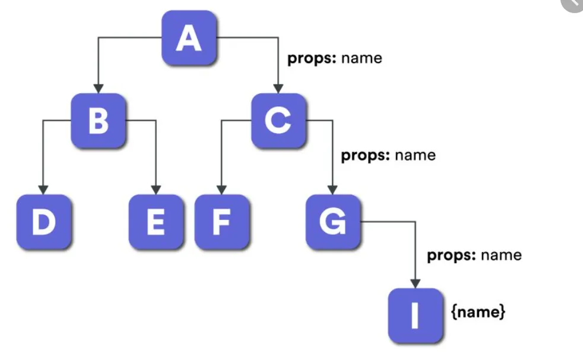
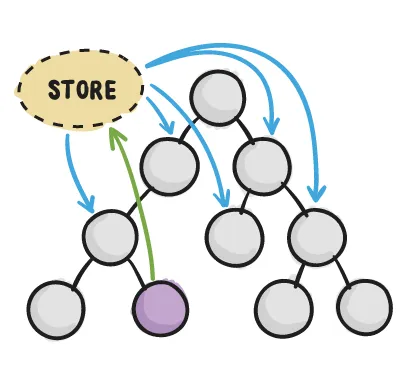
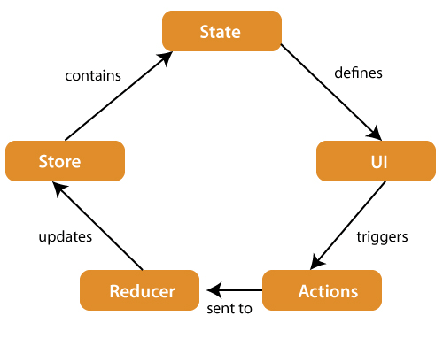

# React Redux

Welcome to your first steps in React Redux!

The goal of these exercises is to give you a brief introduction to using React Redux.

# Getting Started

First of all, make sure that you're using the Node LTS version (v20.15.1).

Clone this repo and run the `npm install` command to install the dependencies.

After the dependencies have been installed, you can run `npm start` to check out the project on your browser.

# The Project & The Problem
As the main goal of this workshop is to get started on React Redux, we will be using a simple To-Do's list app.

There are two main routes on the project:
- /state
- /redux

The "state" route uses the React useState hook to store the state of our application.

Feel free to explore the code for that route under the `src/pages/state/index.js` file. It's components can be found in the `src/components/state` folder.

The main point to pay attention to on this route is the necessity of passing the items of our list as props to the listing components. On a simple application like ours, it might not be a problem to use props, especially because we will be using it on a direct child of the component that bears the data in the first place.

However, imagine that in a big application you might need to use that data on a child of a child of a child component.

For a better visualization, you can think of it as the following: Parent Component > Child 1 > Child 2 > Child 3. Only the parent and child 3 will use the data. But if we use the props approach, both Child 2 and Child 3 will need to receive it so it can be passed on.

This approach creates a classic React issue, known now as Prop Drilling or Component Chaining. This issue can lead to increased complexity as components get nested deeper and deeper, making the flow of props more challenging and unclear. It also leads to component coupling, which makes it harder to refactor or restructure components without affecting other parts of the application. Lastly, it can have a huge impact on performance, especially if you're passing large amounts of data as props.

The image below illustrates a component tree with Prop Drilling:

That said, and thinking about such a potentially harmful issue, how can we prevent it from happening? Well, that's where React Redux comes in handy.

# React Redux
## What is React Redux?
React Redux is the official React binding library for Redux. It allows React components to read data from a Redux Store, and dispatch Actions to the Store to update data.
It helps apps scale by providing a sensible way to manage state.
Essentially, we can access a store that holds states for the whole application directly into our components, without having to pass props from the parent component anymore. We can also dispatch functions to update the state.

React Redux is kept up to date with any API changes to ensure that React components behave as expected and implement many performance optimizations internally, which allows componentes to re-render only when they actually need it.

## The React Redux Flow and It's Components

A *STORE* is a place where the entire state of your application sits. It manages the status of the applications and had a dispatch function.

*ACTIONS* are sent or dispatched from the view and can contain payloads that can be read by the Reducers.

The *REDUCER* reads the payloads from the actions and updates the store via the state accordingly.

As things tend to get more clear with practice, let's hop into our project with no further addos!

# Getting Started with Redux
## Setting up the Reducer
One of the very first steps to work with Redux is to setup our Redux Reducer.

To do so, let's start by creating a `reducers` folder on the src. We will use that folder to store all the files related to Redux.

As you might imagine, we can have multiple Reducers on our application, so let's create another folder to hold all the files related to our todos reducer. You can call it `todos`.

At the moment, your folder structure should look like this: `src > reducers > todos`. (Or however you decided to name your folders).

### Creating the Name File
To start our reducer, create a file called `name.js`. This is a simple file that is used to store the name of your reducer. It is a good practice to create it so the name of the reducers can be changed only in a single place if needed. On this file, simply write the code below:

    export default 'todos'

### Creating the Slice file
With the name file created, create another file called `slice.js`. On this file, we will properly create our *Reducer*.

You can start by importing the `createSlice` function from `@reduxjs/toolkit` and our name const from our `name.js` file.

The two imports should look like this:

    import { createSlice } from '@reduxjs/toolkit'
    import name from './name'

We can now create our Slice by calling the `createSlice` function and passing as arguments a special object. On this special object, we can setup the Slice name, its initial state, and our reducer actions. For the name, we will use our previously imported name const and for the initial state, we will create three properties, which will all be empty arrays: `todo`, `doing` and `done`. For now, let's also create an empty function to create our todos.

    export const todos = createSlice({
        name,
        initialState: {
            todo: [],
            doing: [],
            done: []
        },
        reducers: {
            createTodo: (state, { payload }) => {}
        }
    })

At this point, let's export our reducer functions as actions:

    export const {
        createTodo
    } = todos.actions

And lastly, export the whole reducer:

    export default todos.reducer

### Setting up the Todos Index File

Let's also create an index file for our Slice. For that, create an `index.js` file under the `todos` folder. On that file, import everything from the `slice.js` file and our name const:

    import reducer, * as actions from './slice'
    import name from './name'

Lastly, do the following export:

    export default {
        reducer,
        actions,
        name
    }

If you have problems with ES Lint on the above line, add `// eslint-disable-next-line import/no-anonymous-default-export` above it.

### Setting up the Reducers file

It's a good practice to also keep a reference to all the reducers on a single file so they can all be imported from a single place. For that, create an `index.js` file under the `reducers` folder.

On this file, simply import and export our `todosSlice`.

    import todosSlice from './todos'

    export { todosSlice }

## Create the Store

Create a file to bear our Store in the reducers folder. It is a good practice to call it store.js, but the naming is just a convention.

On this file, import the `configureStore` function from `@reduxjs/toolkit` and our slices from the last created file.

The imports should look like this:

    import { configureStore } from '@reduxjs/toolkit'
    import * as slices from './index'

Before we can properly configure our store, we need to parse our slices. You can achieve this by using the following script:

    const reducer = Object.values(slices).reduce(
        (reducer, slice) => ({ ...reducer, [slice.name]: slice.reducer }),
        {}
    )

With that done, we can now initialize and export our store:

    export default configureStore({ reducer })

## Setup the Provider

To be able to use React Redux on our application, we must wrap our app on a Provider. For that, head to `src/index.js` and import the `Provider` from `react-redux` and the store we have just created:

    import { Provider } from 'react-redux'
    import store from './reducers/store'

Down below, on the render function, we can now use the Provider component to wrap our RouterProvider and pass our store as a prop.

The root.render should look similar to this:

    root.render(
        <React.StrictMode>
            <Provider  store={store}>
                <RouterProvider  router={router} />
            </Provider >
        </React.StrictMode>
    )

With all that done, we are ready to start using React Redux on our application!

# Adding Todos
## Dispatching our Actions
Let's get started by adding an event to add todos to our state. For that, we will create an action on our reducer that will push the new item on the `todo` array.

On a previous step, we've setup a `createTodo` function on our `slice.js` file. Back then, we had only set it up as an empty function, but now we will actually build our function.

Notice that on the action declaration, we are receiving the state and a payload object. The state object will be the current state of our React Redux Store for this Slice, and the payload is whatever we send when we dispatch an action (we will get into this step soon).

That said, to add a new item to our todo list, we simply need to push a new item on the `state.todo` array. Your code for this function should simply look like this:

    createTodo: (state, { payload }) => {
        state.todo.push({ text: payload })
    }

Notice that although we will always be passing a string to the payload, we are storing it on an object with a text property inside our todos array, just as an architectural decision for the whole project.

With our function implemented, we can now use it on our Redux page. Head over to the Redux page. There, you will notice we have an addTodo function that is only clearing our todo state.

To dispatch our actions, we will need to import our `Todos Slice` and the `useDispatch` hook from React Redux. That said, add those two imports:

    import { useDispatch } from 'react-redux'
    import { todosSlice } from '../../reducers'

Before we dispatch our actions, we need to initialize the disptach hook. So add this line at the top of our ReduxPage component:

    const dispatch = useDispatch()

Now, inside our addTodo helper function, we can properly use the dispatch hook and send it to be processed by Redux. For that, we will need to specify which action we want to dispatch and pass the according payload.

As mentioned before, our payload will be simply a string, which is stored in the `todo state`. Our action will be our `createTodo function`.

That said, you can dispatch our createTodo action passing the todo state as the function parameter.

    const addTodo = () => {
        dispatch(todosSlice.actions.createTodo(todo))
        setTodo('')
    }

You can now test out the Todo creation flow!

## Creating a Selector
Noticed that nothing really happened visually? That's because at the moment, although we are adding todos to our state, we're not really using it on our files. If you head over to the todo-list component under the redux folder, you might notice that currently our todos list is fixed to be an empty array, and therefore the state will never be updated.

To start using our React Redux store on this component, we will need to create some selectors. Selectors will allow us to access our Redux Store state with ease.

Head over to our Todos Reducer folder and create a new file called `selectors.js`. On this file, the first thing to do is import our previously created `name` const.

    import name from './name'

With that done, we can create our first selector. It's a good practice to create selectors with their names starting with `select`. Selectors follow a special syntax for their creation. That said, let's create our first selector of our state as a whole:

    const selectSliceData = state => state[name]

Notice that we are using the name to set our selector. This is because the state object will be storing the state of all other reducers we build, so it's important to select just the one that we want (that's the main importance of the name file).

With that general selector for our Todos reducer, we can now create more specific ones so we can access just what we need. Below that, create a new selector to select only the todo list:

    const selectTodo = state => selectSliceData(state).todo

Notice that we've used the state selector we've built before, and from that we're only selecting the todo list, which is why we're interested in this selector.

With our todos selector created, we can now export it using the code below.

    export { selectTodo }

We could export it as the default export of this file, but this approach makes it easier to expand the code in the future as a refactor will not be needed.

Before we can use our Selectors, we need to add them to our Index file. So, head over to the index.js file under the todos reducer folder, and add the following import:

    import * as selectors from './selectors'

Lastly, add the selectors to our export:

    export default {
        reducer,
        actions,
        selectors,
        name
    }

Now, we can use our selector on our component and actually access our React Redux store. For that, head over to the Todos List component once again and add the following imports:

    import { useSelector } from 'react-redux'
    import { todosSlice } from '../../reducers'

We will use the useSelector hook and the selector we've just built to access our state. For that, you can replace the current todos assignment with the following code:

    const todos = useSelector(todosSlice.selectors.selectTodo)

Now, when you follow the add todo flow, the Todos List component shall be updated with the new todo you have just added!

It's important to notice that we are accessing the List of todos directly into the component, without any necessity of receiving it as a prop from a parent component. This is the power of React Redux in a nutshell.

# Setting a Todo as Doing
As you might have noticed while we were building our slice, we have three different possible states for a Todo: Todo, Doing and Done. These "states" are represented by arrays on our Slice data.

At the moment, we are only creating new Todos and adding them to the Todo list, so let's go ahead and add the possibility to move them to the next step!

Let's begin by creating our Doing Selector. Head over to the `selectors.js` file, under our todos reducer folder and create a selector for items on the Doing list:

    const selectDoing = state => selectSliceData(state).doing

Remember to add this selector to our export list below:

    export {
        selectTodo,
        selectDoing
    }

Additionally, we will need to add a new action on our reducer, so go to the `slice.js` file and create a new action to handle the state change:

    export const todos = createSlice({
        name,
        initialState,
        reducers: {
            createTodo: (state, { payload }) => {
                state.todo.push({ text: payload })
            },
            markAsDoing: (state, { payload }) => {
                const todo = state.todo[payload]
                state.doing.push(todo)
                state.todo.splice(payload, 1)
            }
        }
    })

Essentially, our action will receive the index of the item we want to change the state and make a temporary copy of the whole item. Then, it will proceed to add the item on the Doing array and remove it from the Todos array.

With our selector and action created, we can use it inside our components. On the TodoList component for the Redux page, add the necessary imports:

    import { useDispatch } from 'react-redux'

As before, initialize our dispatch:

    const dispatch = useDispatch()

And, on our markAsDoing auxiliary function, simply use our dispatcher to send the item index to our action function:

    const markAsDoing = (index) => {
        dispatch(todosSlice.actions.markAsDoing(index))
    }

As we did previously, we also need to replace the Static empty array attribution for the DoingList by what's stored on our Redux Store. To do so, head to the DoingList component for the Redux Page and add in the following imports:

    import { useSelector } from 'react-redux'
    import { todosSlice } from '../../reducers'

And simply replace the doingList attribution:

    const doings = useSelector(todosSlice.selectors.selectDoing)

With that done, you now should be able to add new todos and move them to the Doing column!

# Exercises
On the exercises folder, you will find two simple exercises to practice using React Redux a little bit. Do your best to complete them, and if you need any assistance, don't hesitate to get in touch with one of the Future Program Masters!

# Useful Resources
- [React Redux Official Page](https://react-redux.js.org/)
- [Prop Drilling in React Explained with Examples](https://www.freecodecamp.org/news/prop-drilling-in-react-explained-with-examples/)
